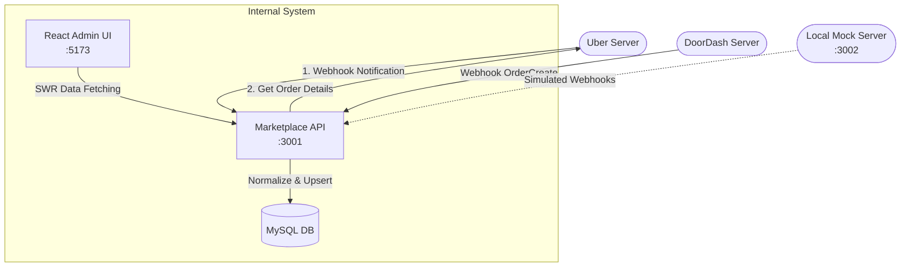

# Marketplace Order System

A full-stack application that unifies food delivery orders from multiple platforms (Uber Eats, DoorDash) into a single, cohesive restaurant dashboard. 

The system receives real-time incoming webhooks from external providers, normalizes the varying data structures into a unified format, and allows restaurant staff to track and manage order statuses from a beautiful React interface.

---

## 🛠 Tech Stack
- **Backend:** Node.js, Express 5, TypeScript
- **Database:** MySQL (using `mysql2/promise`)
- **Frontend:** React, Vite, Tailwind CSS, SWR
- **Monorepo:** npm workspaces

---

## 🏗 Architecture Workflow



---

##  Features
- **Webhook Ingestion:** Securely receives and verifies webhooks using platform-specific authentication (e.g., Uber's HMAC SHA-256 signatures and DoorDash's Bearer tokens).
- **Data Normalization:** Converts totally different Uber and DoorDash JSON payloads into a single `Order` schema.
- **Idempotent Storage:** Uses atomic MySQL `INSERT ... ON DUPLICATE KEY UPDATE` to safely prevent duplicate orders.
- **State Machine:** Enforces a strict, forward-only order progression (`New` ➔ `Accepted` ➔ `Preparing` ➔ `Ready` ➔ `Completed`).
- **Admin Dashboard:** A fast, responsive React UI to view orders, filter by status or platform, and paginate through historical data.

---

##  How to Run Locally

### 1. Prerequisites
- Node.js (v22+)
- A MySQL Database (Local or Cloud like Aiven)

### 2. Setup
Clone the repository and install the dependencies:
```bash
npm install
```

Ensure your `.env` file is properly configured at the root of the project. It must contain your MySQL database URL.

### 3. Start the Application
You can boot the entire system (Backend API, React UI, and the Mock Simulator) with a single command:
```bash
npm run dev
```

- **Admin Dashboard:** Open `http://localhost:5173` in your browser.
- **Marketplace API:** Running on `http://localhost:3001`.
- **Mock Simulator:** Running on `http://localhost:3002`.

---

##  Testing the Webhooks

Because testing real Uber and DoorDash webhooks locally is difficult, this project includes a built-in **Mock Server**. 

### Option A: Using the Local Mock Server (Port 3002)
While the application is running, open a new terminal and run these commands to simulate receiving live food orders:

**Simulate an Uber Eats Order:**
```bash
curl -s -X POST http://localhost:3002/simulator/trigger/uber
```

**Simulate a DoorDash Order:**
```bash
curl -s -X POST http://localhost:3002/simulator/trigger/doordash
```

As soon as you run these commands, the simulated orders will securely flow through the backend API and appear instantly on your React Admin Dashboard!

### Option B: Manual Webhooks to the API (Port 3001)
If you want to manually test exactly how a real external provider would hit the ingestor, use these commands. *(Ensure your `.env` client secrets and tokens match!)*

**1. Uber Eats Webhook:**
Requires an HMAC SHA-256 signature header.
```bash
# Generate the signature using openssl
export SIGNATURE=$(cat fixtures/uber/webhook-orders-notification.json | openssl dgst -sha256 -hmac "mock-client-secret" | awk '{print $2}')

curl -i -X POST http://localhost:3001/webhooks/orders \
  -H "Content-Type: application/json" \
  -H "X-Uber-Signature: $SIGNATURE" \
  -d @fixtures/uber/webhook-orders-notification.json
```

**2. DoorDash Webhook:**
Requires a Bearer token.
```bash
curl -i -X POST http://localhost:3001/webhooks/orders \
  -H "Content-Type: application/json" \
  -H "Authorization: Bearer mock-dd-token" \
  -d @fixtures/doordash/webhook-order-create.json
```

---

## 🗺 Mapping Table

| Internal Field | Uber Eats | DoorDash |
|---|---|---|
| `id` | Generated UUID | Generated UUID |
| `provider` | `'uber'` | `'doordash'` |
| `external_order_id` | `meta.resource_id` | `id` (Webhook `order` obj) |
| `status` | `Get Order -> current_state` | `event.status` (Webhook) |
| `customer.name` | `eater.first_name` + `eater.last_name` | `consumer.first_name` + `consumer.last_name` |
| `customer.phone` | `eater.phone` | `consumer.phone` |
| `line_items[].name` | `cart.items[].title` | `order.categories[].items[].name` |
| `line_items[].quantity` | `cart.items[].quantity` | `order.categories[].items[].quantity` |
| `line_items[].unit_price`| `cart.items[].price.unit_price` | `order.categories[].items[].price` |
| `total_cents` | `payment.charges.total.amount` | `internal normalization: subtotal + tax` |
| `currency` | `payment.charges.total.currency_code` | Default to `USD` |
| `created_at` | `placed_at` (Get Order) | Webhook Ingestion Timestamp |
| `raw_payload` | Full Get Order Response + Webhook | Full Webhook Payload |

---

##  Conflicts Log (Working Notes vs. Official Docs)

As requested, here is the log reviewing the working notes provided in the assignment brief against the official documentation:

### Verified as Correct
- **Uber Webhook Signature:** The working note that `X-Uber-Signature` is an HMAC SHA256 signature of the raw request body was verified as correct.
- **Uber Webhook Response:** Uber does indeed expect a fast HTTP 200 empty response body to acknowledge receipt. We implemented asynchronous processing so we return `200` immediately before doing the secondary `Get Order` fetch.
- **DoorDash Customer Phone:** Customer phone numbers are found in `order.consumer.phone` as noted.

### Rejected / Changed
- **DoorDash monetary fields:** The working notes were uncertain about which field should become `total_cents` and if tax was included. *Change:* We explicitly calculated `total_cents` as the sum of `subtotal` and `tax` to prevent double-counting.
- **Uber raw payload preservation:** *Change:* We updated Uber raw webhook payload preservation to ensure a complete audit trail by storing **both** the webhook notification payload and the subsequent `Get Order` response.

### Overruled by Official Documentation
- **Uber cart in webhook:** The working notes suggested Uber might include the full cart in the webhook payload. *Overruled:* The official Uber documentation confirms the webhook only contains event IDs and resource IDs. A secondary `Get Order` API call using the `resource_id` is strictly required to fetch the cart.
- **DoorDash Marketplace items array:** The working notes mentioned line items might use a top-level `items[]` array. *Overruled:* According to the official DoorDash payload schemas, items are deeply nested inside `order.categories[].items[]`.

---

##  Project Structure

- **`apps/api/`**: The Node.js Express backend. Handles incoming webhooks, validates signatures, normalizes data, and saves to MySQL.
- **`apps/admin/`**: The React frontend dashboard for restaurant staff to manage and progress orders. 
- **`fixtures/`**: Sample JSON payloads from official provider documentation used for testing.
